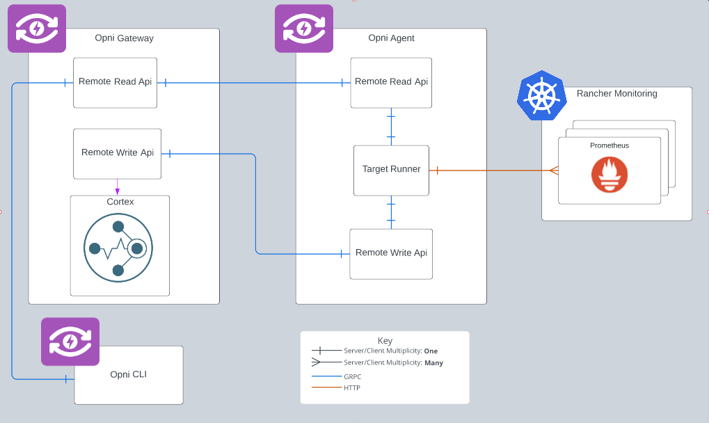

# Title: Rancher Monitoring Data Import

## Summary:

Opni will eventually take ownership of the metrics monitoring functionality of the [rancher monitoring chart](https://github.com/rancher/charts/tree/dev-v2.7/charts/rancher-monitoring). In support of this Opni should be able to import data previously collected by that chart.

should make a best-effort attempt to check the k8s cluster for available Prometheus instances to read from. Once a user has created one or more targets and initiated the import, the associated agent for each target serves as a proxy between the specified remote read target and Opni's cortex by funneling the responses from the remote read into Opni's existing remote write stream into cortex.

## Use case:

The main use case will for current rancher customers looking to update their cluster from `rancher-monitoring` to opni.

## Benefits:

This feature will make the process of migrating data from the to-be-deprecated `rancher-monitoring` storage into Opni's cortex metrics storage, since there is currently no trivial method for users to do this manually, this will provide a smooth transition process for rancher users.

## Impact:

Won't impact any existing Opni functionality.

## Implementation details:

### Data Import

The data import relies primarily on the [remote read API](https://prometheus.io/docs/prometheus/latest/querying/remote_read_api/) provided by Prometheus and many long term Prometheus storage solutions. Once the user provides the import target, they can start the import.

During the import, the Opni agent acts a proxy between the remote read endpoint and the Opni Cortex deployment. The agent will start to read from the specified remote read endpoint, and push that data to the existing Opni [remote write API](../../plugins/metrics/pkg/apis/remotewrite).

### Discovery

Discovery will work by instructing the Opni agent to check the k8s cluster for any `monitoring.coreos.com/Pormetheus` on the cluster to read from, and return the data necessary for the user to point the import to the discovered `Prometheuses`.

## Acceptance criteria:

- [x] The user should be able to discover potential import targets
- [x] The user should be able to add / list / modify / remove import targets
- [x] The user should be able to track the progress of data imports
- [x] The user should be able to stop a progress import (data that has already been imported will still remain in cortex)
- [ ] The user should be able to view / query imported metrics from cortex
- [x] The user should be able to run multiple imports concurrently

## Supporting documents:

## Dependencies:

- [x] Opni needs to support direct communication from the gateway to the agent

## Risks and contingencies:

## Level of Effort:

- Week 1: Implement reading from Prometheus remote read endpoint (done)
- Week 2: Implement discovery

## Resources:

The additional resources needed for the new remote read is negligible.

The resources needed to import data will vary a lot depending on the range and density of the target's metrics data.
